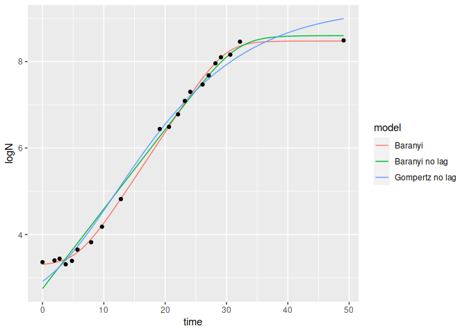
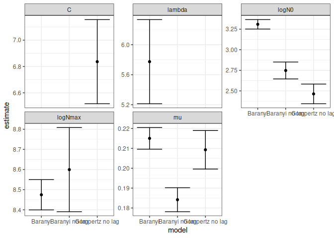
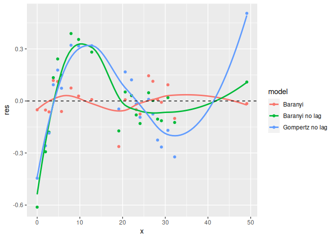
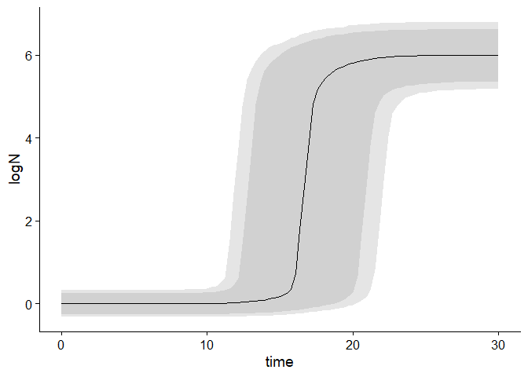
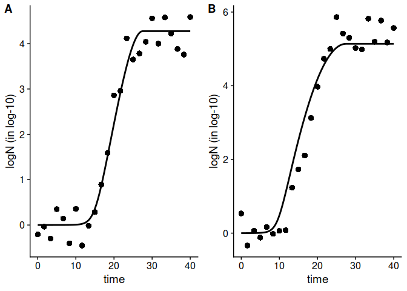

<!-- README.md is generated from README.Rmd. Please edit that file -->

# biogrowth 

    #> ── Attaching packages ─────────────────────────────────────── tidyverse 1.3.0 ──
    #> ✓ ggplot2 3.3.5     ✓ purrr   0.3.4
    #> ✓ tibble  3.1.6     ✓ dplyr   1.0.8
    #> ✓ tidyr   1.2.0     ✓ stringr 1.4.0
    #> ✓ readr   2.1.2     ✓ forcats 0.5.0
    #> ── Conflicts ────────────────────────────────────────── tidyverse_conflicts() ──
    #> x dplyr::filter() masks stats::filter()
    #> x dplyr::lag()    masks stats::lag()

<!-- badges: start -->

[](https://cran.r-project.org/web/checks/check_results_biogrowth.html)
[](https://cran.r-project.org/package=biogrowth)
[](https://cran.r-project.org/package=biogrowth)
[](https://www.tidyverse.org/lifecycle/#maturing)
<!-- badges: end -->

The goal of biogrowth is to ease the development of mathematical models
to describe population growth. It includes functions for making growth
predictions and for fitting growth models. The growth predictions can
account for

  - constant environmental conditions (using only primary growth models)
  - dynamic environmental conditions (accounting for their effect on the
    specific growth rate using secondary growth models)
  - uncertainty in the model parameters

The package includes different approaches for model fitting:

  - fitting primary models
  - fitting both primary and secondary models to data gathered under
    dynamic environmental conditions
  - fitting both primary and secondary models to several experiments
    with different environmental conditions (global fitting)
  - fitting secondary models to a dataset of growth rates obtained under
    different conditions

In all these cases, the package allows choosing which model parameters
to estimate from the data and which ones to fix to known values.

Besides this, the package includes several additional functions to ease
in the interpretation of the calculations. This includes:

  - functions for model comparison
  - functions to obtain a statistical summary of the fit
  - functions to ease visualization of model predictions and model fits
  - functions to calculate the time to reach a given population size
  - functions to facilitate the definition of initial guesses for the
    model parameters

The approach of **biogrowth** is based on the methods of predictive
microbiology. Nonetheless, its equations should be applicable to other
fields. It implements several mathematical models, giving the user the
possibility to select among them.

## Authors

The biogrowth package has been developed by researchers of the Food
Microbiology Laboratory of Wageningen University and Research (the
Netherlands) and the Universidad Politecnica de Cartagena (Spain).

  - Alberto Garre,
  - Jeroen Koomen,
  - Heidy den Besten,
  - Marcel Zwietering.

Questions and comments can be directed to Alberto Garre (alberto.garre
(at) upct.es). For bug reports, please use the GitHub page of the
project.

## Installation

You can install the released version of biogrowth from
[CRAN](https://CRAN.R-project.org) with:

``` r
install.packages("biogrowth")
```

And the development version from [GitHub](https://github.com/) with:

``` r
# install.packages("devtools")
devtools::install_github("albgarre/biogrowth")
```

## Examples

This is only a small sample of the functions included in the package\!
For a complete list, please check the package vignette.

### Fitting of primary model and model comparison/selection

``` r
## We will use the data on growth of Salmonella included in the package

data("growth_salmonella")

## We will fit 3 different models to the data

fit1 <- fit_growth(growth_salmonella, 
                   list(primary = "Baranyi"),
                   start = c(lambda = 0, logNmax = 8, mu = .1, logN0 = 2),
                   known = c(),
                   environment = "constant",
                   )
                   
fit2 <- fit_growth(growth_salmonella,
                   list(primary = "Baranyi"),
                   start = c(logNmax = 8, mu = .1, logN0 = 2),
                   known = c(lambda = 0),
                   environment = "constant",
                   )
                   
fit3 <- fit_growth(growth_salmonella,
                   list(primary = "modGompertz"),
                   start = c(C = 8, mu = .1, logN0 = 2),
                   known = c(lambda = 0),
                   environment = "constant",
                   )
                   
## We can now put them in a (preferably named) list

my_models <- list(`Baranyi` = fit1, 
                  `Baranyi no lag` = fit2, 
                  `Gompertz no lag` = fit3)
                  
## And pass them to compare_growth_fits
                   
model_comparison <- compare_growth_fits(my_models)

##  The instance of GrowthComparison has useful S3 methods

print(model_comparison)
#> Comparison between models fitted to data under isothermal conditions
#> 
#> Statistical indexes arranged by AIC:
#> 
#> # A tibble: 3 × 5
#>   model              AIC    df           ME   RMSE
#>   <chr>            <dbl> <int>        <dbl>  <dbl>
#> 1 Baranyi         -29.7     17  0.000000402 0.0919
#> 2 Baranyi no lag    4.49    18 -0.000000513 0.224 
#> 3 Gompertz no lag   7.47    18  0.000000148 0.241
plot(model_comparison)
```



``` r
plot(model_comparison, type = 2)
```



``` r
plot(model_comparison, type = 3)
#> `geom_smooth()` using formula 'y ~ x'
```



### Growth predictions with uncertainty

``` r
set.seed(1241)

my_model <- "Baranyi"
my_times <- seq(0, 30, length = 100)
n_sims <- 3000

pars <- tribble(
    ~par, ~mean, ~sd, ~scale,
    "logN0", 0, .2, "original",
    "mu", 2, .3, "sqrt",
    "lambda", 4, .4, "sqrt",
    "logNmax", 6, .5, "original"
)

unc_growth <- predict_growth_uncertainty(my_model, my_times, n_sims, pars)

plot(unc_growth)
```



### Fitting to several experiments under dynamic conditions (global fitting)

``` r
## We will use the data included in the package

data("multiple_counts")
data("multiple_conditions")

## We need to assign a model equation for each environmental factor

sec_models <- list(temperature = "CPM", pH = "CPM")

## Any model parameter (of the primary or secondary models) can be fixed

known_pars <- list(Nmax = 1e8, N0 = 1e0, Q0 = 1e-3,
                   temperature_n = 2, temperature_xmin = 20, 
                   temperature_xmax = 35,
                   pH_n = 2, pH_xmin = 5.5, pH_xmax = 7.5, pH_xopt = 6.5)
                   
## The rest, need initial guesses

my_start <- list(mu_opt = .8, temperature_xopt = 30)

## We can now fit the model


global_fit <- fit_growth(multiple_counts, 
                         sec_models, 
                         my_start, 
                         known_pars,
                         environment = "dynamic",
                         algorithm = "regression",
                         approach = "global",
                         env_conditions = multiple_conditions
                         ) 
                         
## The instance of FitMultipleDynamicGrowth has nice S3 methods

plot(global_fit)
```



``` r
summary(global_fit)
#> 
#> Parameters:
#>                  Estimate Std. Error t value Pr(>|t|)    
#> mu_opt            0.54196    0.01222   44.35   <2e-16 ***
#> temperature_xopt 30.62396    0.18728  163.52   <2e-16 ***
#> ---
#> Signif. codes:  0 '***' 0.001 '**' 0.01 '*' 0.05 '.' 0.1 ' ' 1
#> 
#> Residual standard error: 0.4282 on 48 degrees of freedom
#> 
#> Parameter correlation:
#>                  mu_opt temperature_xopt
#> mu_opt           1.0000           0.8837
#> temperature_xopt 0.8837           1.0000
```
