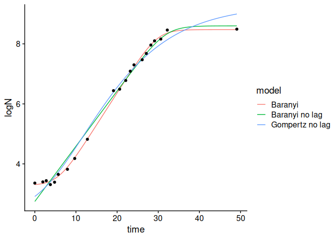

<!-- README.md is generated from README.Rmd. Please edit that file -->

# biogrowth 

<!-- badges: start -->

[](https://cran.r-project.org/web/checks/check_results_biogrowth.html)
[](https://cran.r-project.org/package=biogrowth)
[](https://cran.r-project.org/package=biogrowth)
[](https://www.tidyverse.org/lifecycle/#maturing)
<!-- badges: end -->

The goal of biogrowth is to ease the development of mathematical models
to describe population growth. It includes functions for:

  - making predictions under static environmental conditions.
  - making predictions under dynamic environmental conditions.
  - making predictions under static or dynamic conditions considering
    parameter uncertainty.
  - fitting models to data gathered under static environmental
    conditions.
  - fitting models to data gathered under dynamic environmental
    conditions.

The fuctions in biogrowth follow the methods of predictive microbiology,
where the modelling process is divided two steps: primary and secondary
modelling. The user has the flexibility to choose between several
primary (Baranyi, modified Gompertz and Trilinear) and secondary models
(cardinal parameter model, Zwietering-type model, full Ratkowsky model).

## Authors

The biogrowth package has been developed by researchers of the Food
Microbiology Laboratory of Wageningen University and Research.

  - Alberto Garre,
  - Jeroen Koomen,
  - Heidy den Besten,
  - Marcel Zwietering.

Questions and comments can be directed to Alberto Garre
(alberto.garreperez (at) wur.nl). For bug reports, please use the GitHub
page of the project.

## Installation

You can install the released version of biogrowth from
[CRAN](https://CRAN.R-project.org) with:

``` r
install.packages("biogrowth")
```

And the development version from [GitHub](https://github.com/) with:

``` r
# install.packages("devtools")
devtools::install_github("albgarre/biogrowth")
```

## Example

As an example of the features included in the package, the following
code chunk generates a prediction of microbial growth under dynamic
conditions considering parameter uncertainty.

``` r
library(tidyverse)
#> ── Attaching packages ─────────────────────────────────────── tidyverse 1.3.0 ──
#> ✓ ggplot2 3.3.5     ✓ purrr   0.3.4
#> ✓ tibble  3.1.6     ✓ dplyr   1.0.8
#> ✓ tidyr   1.2.0     ✓ stringr 1.4.0
#> ✓ readr   2.1.2     ✓ forcats 0.5.0
#> ── Conflicts ────────────────────────────────────────── tidyverse_conflicts() ──
#> x dplyr::filter() masks stats::filter()
#> x dplyr::lag()    masks stats::lag()
library(biogrowth)
set.seed(1241)

my_model <- "Baranyi"
my_times <- seq(0, 30, length = 100)
n_sims <- 3000

pars <- tribble(
    ~par, ~mean, ~sd, ~scale,
    "logN0", 0, .2, "original",
    "mu", 2, .3, "sqrt",
    "lambda", 4, .4, "sqrt",
    "logNmax", 6, .5, "original"
)

stoc_growth <- predict_stochastic_growth(my_model, my_times, n_sims, pars)
#> Warning: `predict_stochastic_growth()` was deprecated in biogrowth 1.0.0.
#> Please use `predict_growth_uncertainty()` instead.
#> This warning is displayed once every 8 hours.
#> Call `lifecycle::last_lifecycle_warnings()` to see where this warning was generated.

plot(stoc_growth)
```


As an additional example, the following code chunk fits a model to a set
of experiments under dynamic conditions.

``` r

## We will use the multiple_experiments data set

data("multiple_experiments")

## For each environmental factor, we need to defined a model

sec_names <- c(temperature = "CPM", pH = "CPM")

## Any model parameter can be fixed

known <- list(Nmax = 1e8, N0 = 1e0, Q0 = 1e-3,
    temperature_n = 2, temperature_xmin = 20, temperature_xmax = 35,
    pH_n = 2, pH_xmin = 5.5, pH_xmax = 7.5, pH_xopt = 6.5)

## The rest require starting values for model fitting

start <- list(mu_opt = .8, temperature_xopt = 30)

## We can now call the fitting function

global_fit <- fit_multiple_growth(start, multiple_experiments, known, sec_names)

## Any single environmental factor can be added to the plot using add_factor

plot(global_fit, add_factor = "temperature")
```



This is only a small sample of the functions included in the package.
For a complete list, please check the package vignette.
